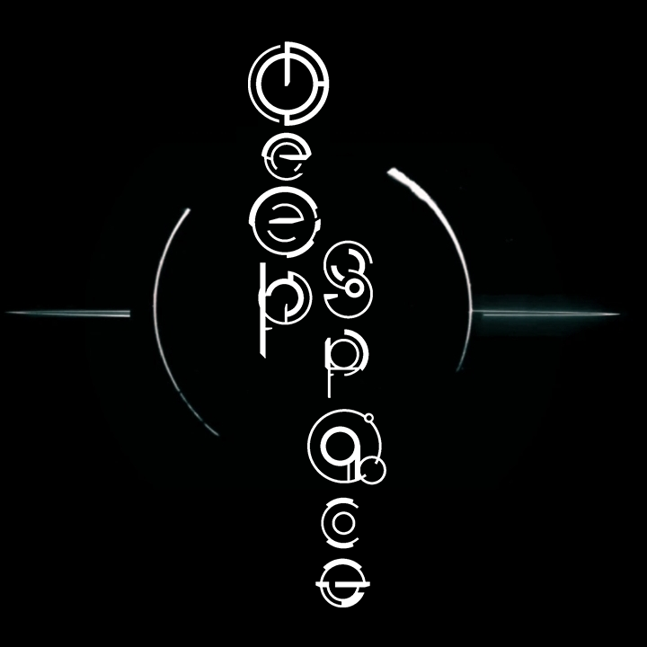
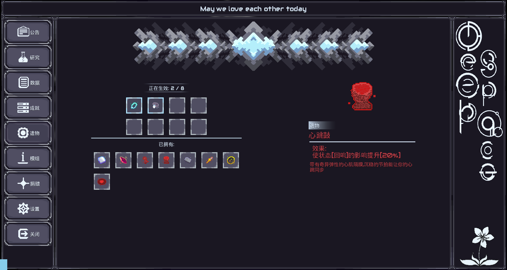
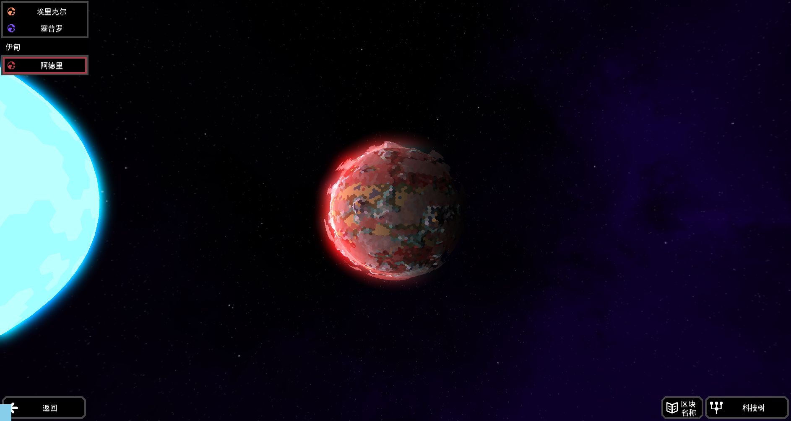
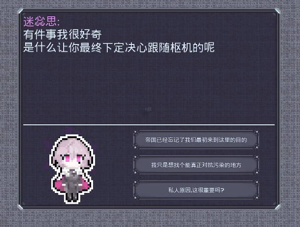

[简体中文](README.md)|English 

    

---
# ___DeepSpace___

A ___multi-faceted content___ Mindustry __Kotlin/Java__ mod.

## Our concept
- From planets to buildings, we manage to eliminate excessive numerical values and content, and instead add mechanisms to settle the issue of homogeneity.

## Highlights
### Remains

---

### Planets

---

### Character dialogue
~~OMG galgame~~

---

## Have any additional suggestions or questions?
- __My QQ__: 2315079583
- __Our QQ group chat used for test__: 1078329722